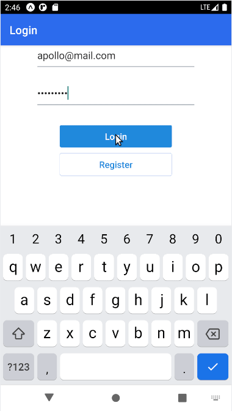

# Snapchat Clone

  

Signal Clone is a limited implementation of [Signal mobile app](https://play.google.com/store/apps/details?id=org.thoughtcrime.securesms&hl=pt_BR&gl=US).

The features implemented in this clone are:

  * Registration, login and logout actions;
  * Chat room creation;
  * Send messages in the chat.

Tools used in the development:

  * React Native;
  * [Expo](https://expo.io/);
  * Firebase.

This project has study purposes only.

## How to run this app?

Install [Expo CLI](https://docs.expo.io/workflow/expo-cli/). In the project folder:

  * Run `npm install`;
  * Configure you [Firebase](https://firebase.google.com/?hl=pt-br) project, including authentication an DB;
  * Create your `.env.js` based on `.env.example.js`, and fill it with your Firebase project settings;
  * Run `npm start`.

## How to deploy this app?

The following instructions are a suggestion of how to configure you deploy if you just wanna do that for testing and have an URL to share.

To deploy your app you need to have [Firebase CLI](https://www.npmjs.com/package/firebase-tools) installed.

  * Run `expo build:web`;
  * Login in your Firebase account with `firebase login`;
  * Run `firebase init`. You should select your project through the options, type to use `web-build` as your *public directory*, and select to configure as a SPA;
  * Run `npm deploy`.

Alternatively, you can run `expo publish` ([Expo](https://expo.io/) account required).
